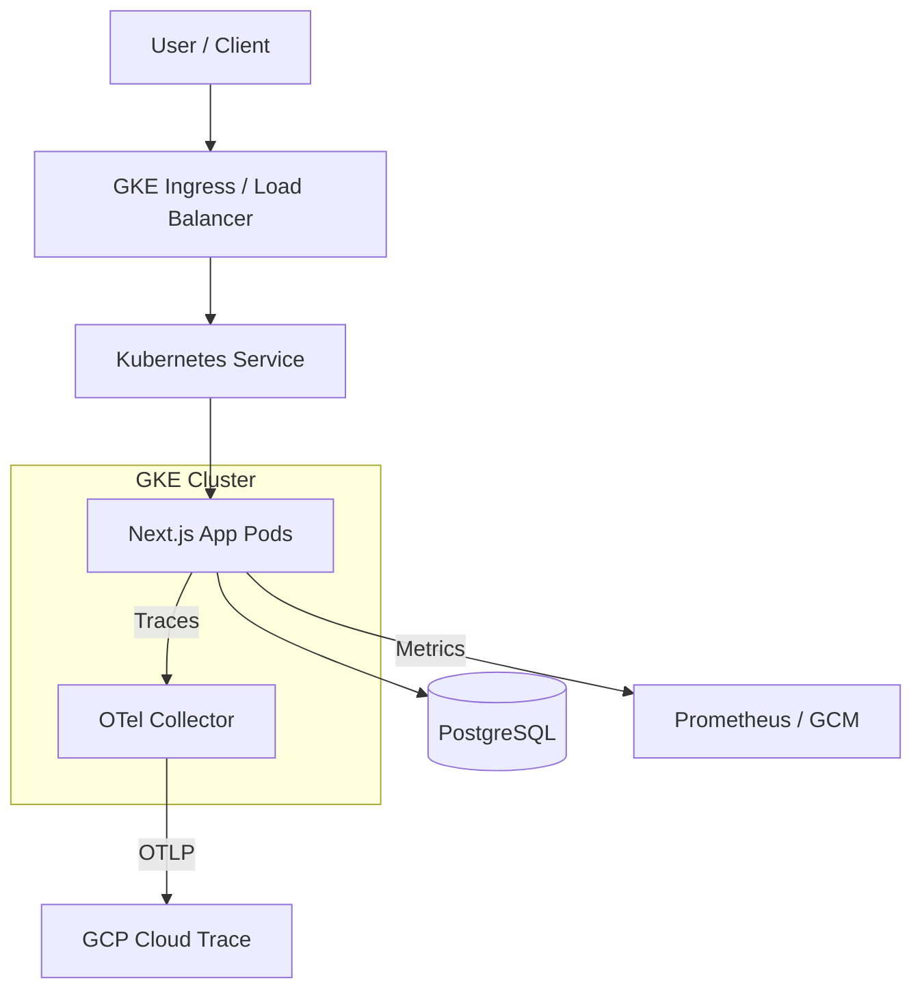

# 架構總覽 (Architecture Overview)

本文件提供了 **test-k8s-app** 專案的架構、技術棧及部署策略的完整概述。

## 1. 專案結構 (Project Structure)

```text
/
├── k8s/                         # Kubernetes Manifests (針對 GKE)
├── public/                      # 靜態資源 (Images, Icons)
├── scripts/                     # 自動化與 Review 腳本
├── docs/                        # 參考文件規範
│   ├── specs/                   # AI歷史需求歸檔（歸檔，供 AI 檢索参考）
│   └── style_guides/            # 開發風格指南與規範
├── src/                         #
│   ├── app/                     # Next.js App Router (頁面、佈局、API Routes)
│   │   ├── (api)/               # 內部 API 路由 (Health Check, Metrics)
│   │   └── ...                  # 前端頁面
│   ├── lib/                     # 共用函式庫與工具函式
│   │   ├── db.ts                # PostgreSQL 連線管理 (使用 postgres.js)
│   │   └── metrics.ts           # Prometheus Metrics 配置
│   ├── types/                   # 全域 TypeScript 型別定義
│   ├── instrumentation.ts       # Next.js Instrumentation 入口點
│   └── instrumentation.node.ts  # OpenTelemetry Node.js SDK 設定
├── .github/                     # CI/CD 工作流 (GitHub Actions)
├── Dockerfile                   # Container Image 定義
├── CLAUDE.md                    # CLAUDE rules
├── .geminirules                 # Gemini rules
├── ARCHITECTURE.md              # 專案技術藍圖
├── DESIGN.md                    # 當前執行的規格 (AI 讀取的焦點)
├── DESIGN.template.md           # 規格模板 (供複製使用)
└── package.json                 # 專案依賴與腳本
```

## 2. 高階系統架構圖 (High-Level System Diagram)

本應用程式是一個部署在 Google Kubernetes Engine (GKE) 上的全端 Next.js 服務。



## 3. 核心組件 (Core Components)

### 3.1. 前端與後端 (Frontend & Backend - Monolith)

- **框架 (Framework):** [Next.js 16.1.6](https://nextjs.org/) (App Router) 搭配 [React 19](https://react.dev/)。
- **職責:**
    - SSR (Server-Side Rendering) 與用戶端互動。
    - Server Actions 與 API Routes 處理後端邏輯。
    - 資料庫編排與可觀測性 (Observability) 儀表化。
- **技術:** TypeScript, Vanilla CSS。

### 3.2. 可觀測性 (Observability - OpenTelemetry & Prometheus)

- **追蹤 (Tracing):** 
    - 透過 `src/instrumentation.node.ts` 進行管理。
    - 使用 OpenTelemetry Node SDK。
    - 支援 W3C 與 Cloud Trace (X-Cloud-Trace-Context) 格式的 Context Propagation。
    - 將 Traces 導出至 GKE 託管的 OTel Collector。
- **指標 (Metrics):** 
    - 透過 `/metrics` 暴露指標。
    - 使用 `prom-client` 收集 Node.js 預設指標及自定義指標。
- **健康檢查 (Health Checks):** 
    - 透過 `/healthz` 提供 K8s Liveness, Readiness 與 Startup Probes 使用。

## 4. 資料儲存 (Data Stores)

### 4.1. PostgreSQL

- **函式庫:** [postgres.js](https://github.com/porsager/postgres) (高效能的 PostgreSQL 用戶端)。
- **用途:** 主要的應用程式資料庫，用於持久化儲存。
- **連線管理:** 透過 `src/lib/db.ts` 管理連線池 (Connection Pooling)。
- **安全性:** 資料庫密碼從 `/var/secrets/db-password.txt` 讀取 (透過 K8s Secrets Store CSI 掛載)，或回退至環境變數。

## 5. 部署與基礎設施 (Deployment & Infrastructure)

- **雲端供應商:** Google Cloud Platform (GCP)。
- **編排工具:** Google Kubernetes Engine (GKE)。
- **基礎設施關鍵特性:**
    - **Workload Identity:** Pod 使用與 GSA 綁定的 KSA 以安全存取 GCP 服務。
    - **秘密管理 (Secrets Management):** 透過 Secrets Store CSI Driver 與 GCP Secret Manager 整合。
    - **自動擴展 (Autoscaling):** 基於 CPU/Memory 使用率的 Horizontal Pod Autoscaler (HPA)。
    - **網路:** 使用 GKE Ingress，配備 Google 託管的 SSL 憑證及用於健康檢查的 BackendConfig。
- **CI/CD:** 使用 GitHub Actions 構建 Image 並部署至 GKE。

## 6. 安全性考量 (Security Considerations)

- **驗證與授權 (Auth):** (待實作後補齊)。
- **秘密注入:** 秘密資訊不直接儲存在環境變數中，而是從 Secret Manager 掛載為 Volume。
- **執行階段安全:** 限制 Container 資源 (1 CPU, 1GB RAM) 以避免資源爭奪與 OOM Kills。

## 7. 開發與測試 (Development & Testing)

- **本地開發:** 
    - 使用 `.env.local` 進行本地配置。
    - 執行 `yarn dev` 啟動開發伺服器。
- **程式碼品質:** 使用 ESLint 進行靜態檢查，TypeScript 確保型別安全。

## 8. 專案識別 (Project Identification)

- **專案名稱:** test-k8s-app
- **主要環境:** GKE (asia-east1)
- **最後更新日期:** 2026-05-12
